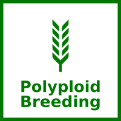

# Welcome to drone2report documentation!

 
**drone2report** : from orthophoto to summary statistics, indexes, and more.

## Usage

Clone the repository:

`git clone https://github.com/ne1s0n/drone2report.git`

Install [conda](https://docs.conda.io/mediaojects/conda/en/latest/user-guide/install/index.html) (if you don't have it already) and create the conda enviroment with:

```
cd drone2report
conda env create --file environment.yml
```

Activate the environment:

`conda activate drone2report`

then fill an apmediaomediaiate .ini file and run:

`python3 drone2report.py <your config .ini file>`

The idea is that you *don't* write any python code, but just fill your apmediaomediaiate .ini file.

Then, if you really really want, you can write some python code (i.e. you can easily expand the pipeline with your own custom analyses).

The 
[sample_config.ini](sample_config.ini) file is self documented and should be easy enough to understand to let you start.

## The steps

The pipeline runs through three steps

- data load: one data block per image. All active images are loaded (with their accompanying shapefile). Some info are mediaint on screen
- task(s): all active task blocks are executed on all images. Their results are saved on disk
- render(s): all renders are executed to collect and consolidate the tasks results. The results are again saved on disk

## Credits

This is a joint effort between:

[](https://www.crea.gov.it/)
[](https://www.npec.nl/)


The development has also been sponsored by the [Polyploidbreeding project](https://polyploidbreeding.ibba.cnr.it/) (PRIN 2022, Settore LS2)

[](https://polyploidbreeding.ibba.cnr.it/)

